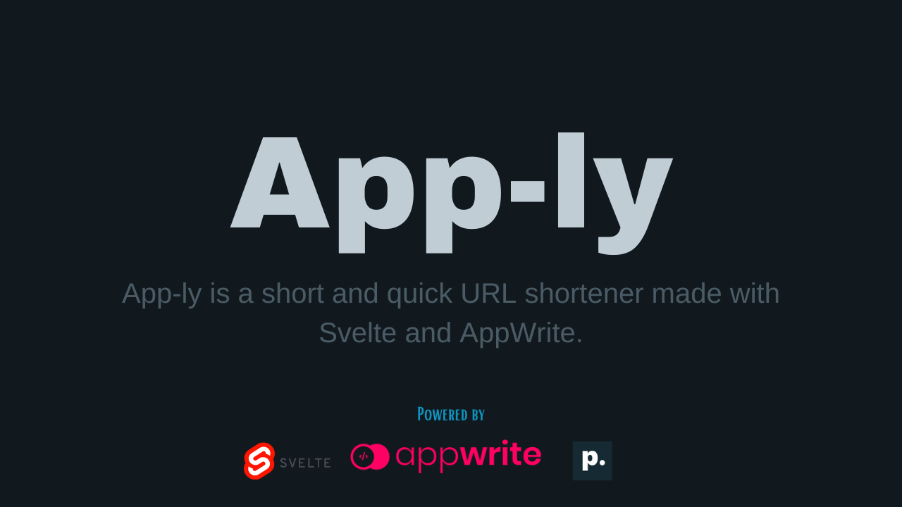
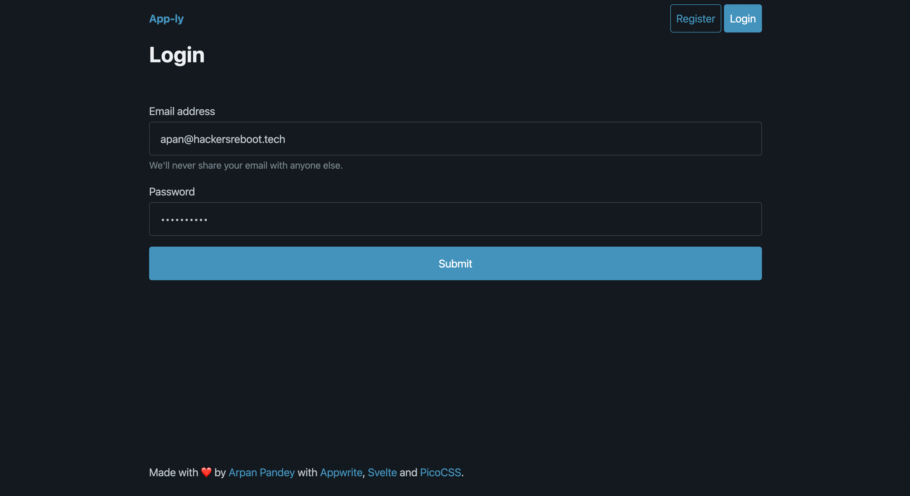

# App-ly



App-ly is an open-source URL shortener made using Svelte and Appwrite. It is a web app that allows you to shorten long URLs, share them, and generate QR Codes for them. 

## Acknowledgements

 - [Appwrite](https://appwrite.io/)
 - [PicoCSS](https://picocss.com/)
 - [Svelte](https://svelte.dev/)


## Authors

- [@Arpan-206](https://www.github.com/Arpan-206)


## License

[MIT](https://choosealicense.com/licenses/mit/)


## Run Locally

#### Clone the project

```bash
  git clone https://github.com/Arpan-206/app-ly.git
```

#### Go to the project directory

```bash
  cd app-ly
```

#### Install dependencies

```bash
  npm install
```

or 

```bash
  yarn install
```

#### Start the development server

```bash
  npm run dev
```

or 

```bash
  yarn run dev
```

#### Build for production

```bash
  yarn run build
```

or 

```bash
  npm run build
```

#### Preview production build

```bash
  npm run preview
```

or

```bash
  yarn run preview
```

## Environment Variables

To run this project, you will need to add the following environment variables to your .env file

`PUBLIC_AW_PROJECT`

`PUBLIC_AW_ENDPOINT`

`PUBLIC_AW_DB`

`PUBLIC_AW_ANON_COLLECTION`

`PUBLIC_AW_LOGIN_COLLECTION`


## Roadmap

- Link Groups

- Profile Links

- Bulk Redirects


## Screenshots





## Contributing

Contributions are always welcome!

See `contributing.md` for ways to get started.

Please adhere to this project's `code of conduct`.


## Support

For support, email [arpan@hackersreboot.tech](mailto:arpan@hackersreboot.tech).

